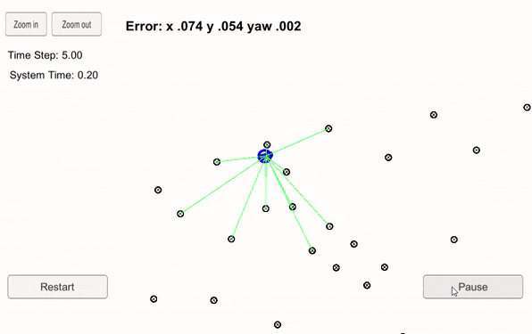

Project 3, Term 2: Kidnapped Vehicle
=======================

### Final Result

### Accuracy

**Does your particle filter localize the vehicle to within the desired accuracy?**

Although desired measurments were not provided for this project, the particle filter simulator output indicates a successful execution:

### Performance

**Does your particle run within the specified time of 100 seconds?**

The particle filter runs in 51.54 seconds (see above)

### General

**Does your code use a particle filter to localize the robot?**

The particle filter code:

-   Follows the framework provided in the Kidnapped Vehicle project workspace,

-   Is based on the code and principals discussed in Lesson 14: Implementation of a Particle Filter,

-   Successfully runs in the simulator
