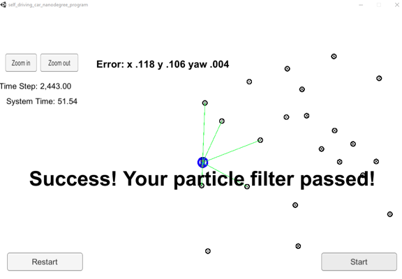
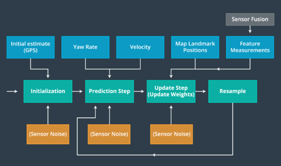

Project 3, Term 2: Kidnapped Vehicle
=======================

### Final Result

My c++ skills continue to improve, but the projects are also getting more difficult.
Since I'm still far from an expert, I used Chao Wang's project as a reference for
tying lesson 14 together.

### Accuracy

**Does your particle filter localize the vehicle to within the desired accuracy?**

Although desired measurments were not provided for this project, the particle filter simulator output indicates a successful execution:

### Performance

**Does your particle run within the specified time of 100 seconds?**

The particle filter runs in 51.54 seconds (see above)

### General

**Does your code use a particle filter to localize the robot?**

The particle filter code is based on the algorithm presented in Lesson 14, Implementation of a particle Filter:

 
